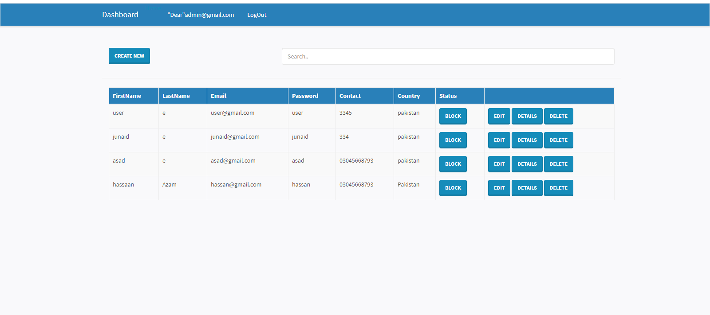
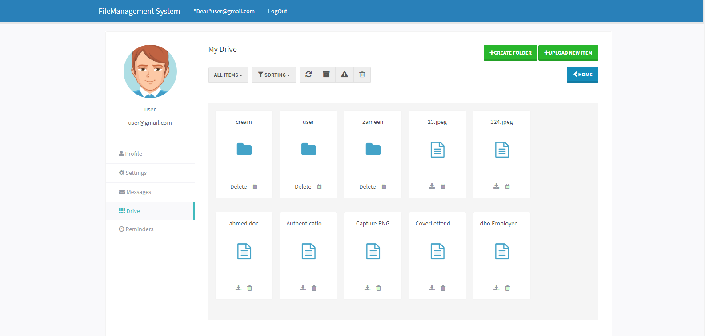

# SoftwareBackupSystem

Project description

The system comprises of 2 major modules with their sub-modules as follows:

✅ Admin

1- Login: Admin need to login first to access the below given modules.

2-Add User: System allows admin to add / register new user into the system.

3- View / Delete User: Admin can view all registered user’s and also can delete a user from
the system.

3-Block / Unblock User: Admin has the right to block or unblock a user from the system.

✅ User

1- Login: User need to login using their valid username and password to login into the
system.

2-Upload a File: After successful login, user can now upload a file, which will be stored in
their own folder.

3-Copy / Delete a File: Once a file is uploaded, user can copy or delete the uploaded file.

4-Download a File: Whenever user request to download a file, the file from the user’s folder
gets downloaded into local system

